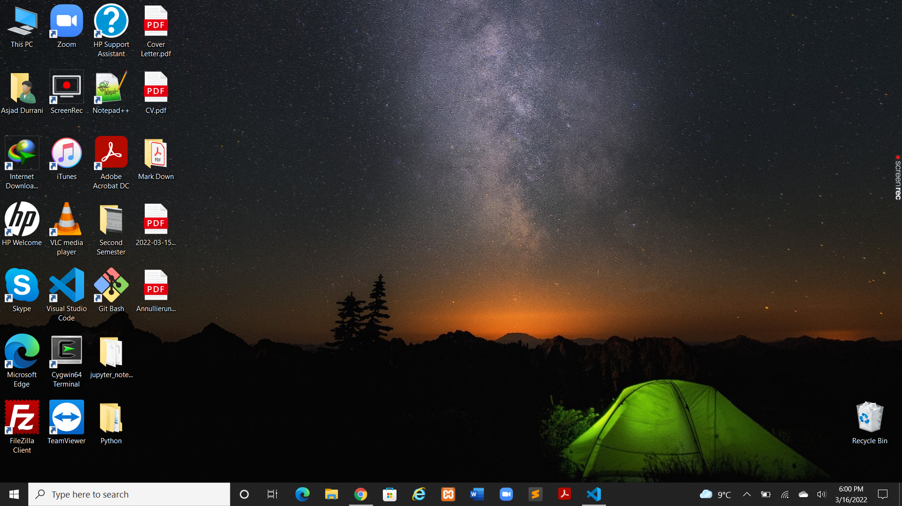

Press ctrl + shift + p to open output window.
Press ctrl + k + v to open output window.

# 1- Headings

# Heading
## Heading
### Heading
#### Heading
##### Heading
###### Heading
# -----------------------------------------
# 2-Block Of Words/Citation

This is a normal text but down!
> This is special text
>
> This is special text

> This is special text with space between two

> This is special text
# -----------------------------------------
# 3-Line Break

##### (back slash(\) is use to break the line or simply press enter)

My name is asjad and i am living in chemnitz,Germany.\
I am student in TU CHEMNITZ.

# -----------------------------------------

# 4-Combine two things

Block of words and Heading

> # Heading 
>
> # Heading 

> ## Heading 

> ## Heading 

# -----------------------------------------
# 5-Face of Text

**Bold**

*Italic*

***Bold and Italic***

Or we can use _(underscore)

__BOLD__

_Italic_

___Bold and Italic___

# -----------------------------------------

# 6- Bullet points/List
(Important: Press tab to make sub lists)

- Day 1
- Day 2
- Day 3
- Day 4
- Day 5
    - Day 5A 
        - Sub List
    - Day 5B

> # Numbering Of lists

1. Day 1
2. Day 2
3. Day 3
4. Day 4
5. Day 5
    1. Day 5A
        1. Sub list
    2. Day 5B

> # (* and + is also use to make bullets of list)
* hellow
+ hellow
    + hellow
        + hellow

# -----------------------------------------

# 7-Line break or page break
( Important: using -,*,_ to make a line)

--------------------------------
********************************
________________________________

# 8- Links and Hyper Links

<https://www.youtube.com/watch?v=qJqAXjz-Rh4&list=PL9XvIvvVL50HVsu-Ao8NBr0UJSO8O6lBI&index=23>


[Click here to play the videos](https://www.youtube.com/watch?v=qJqAXjz-Rh4&list=PL9XvIvvVL50HVsu-Ao8NBr0UJSO8O6lBI&index=23)


[Codanics]:https://www.youtube.com/watch?v=qJqAXjz-Rh4&list=PL9XvIvvVL50HVsu-Ao8NBr0UJSO8O6lBI&index=23


Hellow link is [here][codanics]
# -----------------------------------------

# 9- Images and Figures with Links

Here is the image
First put image in same markdown file folder and write code here.




> Online picture 5


# -------------------------------------------

# 10- How to comment out in Markdown language

[comment]: 

# --------------------------------------------

# 11- Adding Code or Code Block

(Important: near to 1 no on keyboard you can see ` symbol)

Hellow please `print("Python")`

```
x=5

print(x)

```
> for different codes we use different language-names and thats why code have differnt colors in start

``` python
x=5

print(x)

```

# 12- Adding Tables


(Important: Use " : "semicolon to allign the values)

| Species | Petal Length | Sepal Length |
|:-------:|:------------:|:------------:|
| Satosa  |     18.2     |    19.2      |
| Aseria  |     14.2     |    10.2      |
| yunika  |     12.2     |    1.2       |
| Satosa  |     18.2     |    19.2      |
| Aseria  |     14.2     |    10.2      |
| yunika  |     12.2     |    1.2       |

# ---------------------------------------

# 13-  Content

(Important: To access or search the data then use below function)

1. [Headings](#1--headings)

1. [Block Of Words](#2-block-of-words)

2. [Line Break](#3-line-break)

> # OR

[1-Headings](#1--headings)\
[2-Block Of Words](#2-block-of-words)\
[3-Line Break](#3-line-break)

# ----------------------------------------
# 14- Install extension

* Markdown all in one
* mark down pdf
* mark down shortcuts
* markdownlint

# ----------------------------------------

# 15- Use extension

(Important: Just type anything and then right click on it and do what you want)

_**Sample text**_

# -------------------------------------------


# 16- How to add colors
(Important: Use hexcodes)

<span style="color:red">
"This text is red"
</span>

# -------------------------------------------

# 17- Adding Equations

(Important: Use as inline)

$this_is^{inline}$

(Math Block)

$$
s = ut + ½ at2
$$
